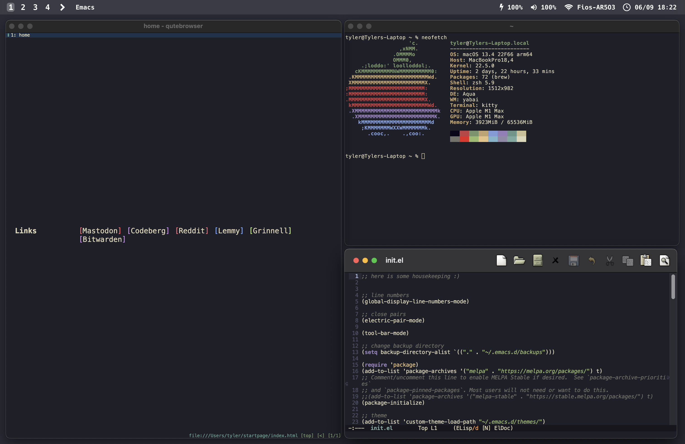

# macos-dotfiles
This repository houses my dotfiles for my MacBook Pro M1 Max.

Web Browser: [qutebrowser](https://qutebrowser.org)

Terminal: [kitty](https://sw.kovidgoyal.net/kitty)

Text Editor: [emacs-plus](https://github.com/d12frosted/homebrew-emacs-plus)

Window Manager: [yabai](https://github.com/koekeishiya/yabai)

Status Bar: [SketchyBar](https://github.com/FelixKratz/SketchyBar)